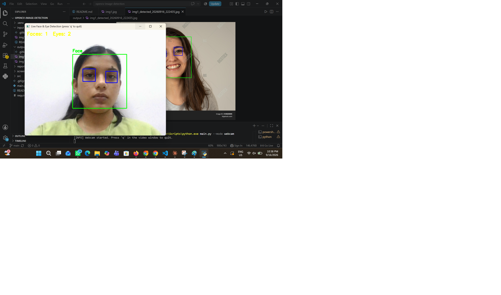

# Project Report

## Face and Eye Detection Using OpenCV Haar Cascade Classifiers

### Submitted By

**Name:** DEVANSHI SHARMA
**Registration No.:** 24BAI10556
**Course Code:** CSE3010
**Instructor:** Dr. Siddharth Singh Chouhan
**Submission Date:** 18 September 2026

---

## 1. Abstract

This project is based on face and eye detection using Python and OpenCV. The main aim of the project is to detect human faces and eyes from an image and also provide real-time detection using a webcam.

For face and eye detection, the project uses OpenCV's Haar Cascade classifiers. The input image is first converted into grayscale and processed before applying the detection algorithm. Once a face is detected, the system searches for eyes inside the detected face region. Bounding boxes are then drawn around the detected faces and eyes.

The project was tested successfully on a sample image and also using a webcam. In the sample image used for testing, the system detected **2 faces and 2 eyes**. The project demonstrates how basic computer vision techniques can be implemented using OpenCV without requiring a GPU or a large machine-learning model.

---

## 2. Introduction

Computer vision is a field of computer science that allows computers to understand and process images and videos. Face detection is one of the common applications of computer vision and is used in many systems such as photo applications, video calls, security systems and attendance systems.

In this project, I implemented a simple face and eye detection system using OpenCV. OpenCV provides several useful tools for image processing and object detection. I used Haar Cascade classifiers because they are simple to implement and can work efficiently on a normal computer.

The project helped me understand basic concepts such as image reading, grayscale conversion, image preprocessing, object detection and drawing bounding boxes on detected objects.

---

## 3. Problem Statement

The objective of this project is to develop a system that can automatically detect human faces and eyes in an input image and mark the detected regions using bounding boxes.

The system should also be able to detect faces and eyes in real time using a webcam.

---

## 4. Objectives

The main objectives of this project are:

1. To read and process images using OpenCV.
2. To understand basic image preprocessing techniques.
3. To detect human faces using Haar Cascade classifiers.
4. To detect eyes within the detected face regions.
5. To draw bounding boxes around detected faces and eyes.
6. To save the processed image as an output.
7. To implement real-time face and eye detection using a webcam.
8. To understand the basic working of classical computer vision algorithms.

---

## 5. Background

Face detection has been an important problem in computer vision for many years. One of the well-known classical approaches is the **Viola-Jones object detection framework**, which uses Haar-like features and a cascade of classifiers.

OpenCV provides Haar Cascade XML files that can be used directly for detecting objects such as faces and eyes. These classifiers are lightweight and can run on a CPU, making them suitable for simple computer vision projects.

Modern applications also use deep-learning-based methods for face detection. However, Haar Cascades are easier to understand and implement, which makes them useful for learning the basic concepts of object detection.

---

## 6. Technologies Used

| Technology   | Purpose                                 |
| ------------ | --------------------------------------- |
| Python       | Main programming language               |
| OpenCV       | Image processing and face/eye detection |
| NumPy        | Numerical and image-related operations  |
| Haar Cascade | Face and eye detection                  |
| Git          | Version control                         |
| GitHub       | Project repository and code management  |
| VS Code      | Development environment                 |

---

## 7. Methodology

The project follows the following steps:

### Step 1: Input Image

The system takes an image from the `input` folder. The project can also take frames from a webcam for real-time detection.

### Step 2: Image Preprocessing

The image is processed before detection. It is resized and converted from a colored image into grayscale. Grayscale images make the detection process simpler because the classifier mainly works with intensity information.

### Step 3: Face Detection

The preprocessed image is passed to the Haar Cascade face classifier. The classifier searches the image for patterns that match a human face.

### Step 4: Eye Detection

After detecting a face, the detected face area is treated as a region of interest. The eye classifier is then applied only to this region to find the eyes.

### Step 5: Annotation

Bounding boxes are drawn around the detected faces and eyes. Labels can also be added to make the result easier to understand.

### Step 6: Output

The final processed image is saved in the `output` folder. The number of detected faces and eyes is also displayed in the terminal.

---

## 8. System Architecture

The overall working of the project can be represented as:

```text
        Input Image / Webcam
                 |
                 v
        Image Preprocessing
                 |
                 v
          Face Detection
          (Haar Cascade)
                 |
                 v
       Detected Face Region
                 |
                 v
           Eye Detection
          (Haar Cascade)
                 |
                 v
       Draw Bounding Boxes
                 |
                 v
          Display / Save
             Output
```

---

## 9. Project Structure

The project is organized into different folders and files:

```text
opencv-image-detection/
│
├── README.md
├── requirements.txt
├── main.py
│
├── src/
│   ├── __init__.py
│   ├── preprocessing.py
│   ├── detector.py
│   └── utils.py
│
├── input/
│   └── img1.jpg
│
├── output/
│   └── detected output image
│
├── screenshots/
│   ├── image_detection_terminal.png
│   ├── detected_output.png
│   └── webcam_detection.png
│
└── report/
    └── project_report.md
```

---

## 10. Implementation

The project is divided into different Python files to keep the code organized.

### `main.py`

This is the main file of the project. It takes the required arguments and starts either image detection or webcam detection.

### `preprocessing.py`

This file contains functions related to image preprocessing, such as loading, resizing and converting the image to grayscale.

### `detector.py`

This file contains the main face and eye detection logic. It uses the Haar Cascade classifiers provided by OpenCV.

### `utils.py`

This file contains helper functions related to folders, file paths and saving output images.

---

## 11. Algorithm Used

The project uses the **Haar Cascade algorithm** for face and eye detection.

The basic working is:

1. The input image is given to the classifier.
2. The classifier searches different areas of the image.
3. Haar-like features are used to identify patterns related to a face.
4. The cascade classifier removes areas that do not match the required pattern.
5. The remaining areas are considered possible face detections.
6. The eye classifier is then applied to the detected face regions.
7. Bounding boxes are drawn around the detected objects.

The `detectMultiScale()` function in OpenCV is used for detecting multiple objects at different sizes in an image.

---

## 12. Input Image

For testing the project, I used a sample image named:

```text
img1.jpg
```

The image was placed inside the `input` folder.

The project was also tested using a webcam to check whether the system could perform face and eye detection in real time.

---

## 13. Results

The project was successfully executed using Python and OpenCV.

For the sample image `img1.jpg`, the terminal displayed:

```text
[INFO] Processing: input/img1.jpg
[RESULT] Faces detected: 2 | Eyes detected: 2
[INFO] Output saved to: output\img1_detected_20260916_222435.jpg

[DONE] Processing complete.
```

### Result Table

| Input Image | Faces Detected | Eyes Detected |
| ----------- | -------------: | ------------: |
| `img1.jpg`  |              2 |             2 |

The processed image was successfully saved in the `output` folder.

The webcam mode was also tested successfully and was able to detect faces and eyes in real time.

---

## 14. Screenshots

The project screenshots are available in the `screenshots` folder.

### 14.1 Image Detection Terminal

This screenshot shows the project being executed on the input image and the detection results displayed in the terminal.


### 14.2 Detected Output

This screenshot shows the output image after face and eye detection.


### 14.3 Webcam Detection

This screenshot shows the real-time face and eye detection using the webcam.



---

## 15. Advantages

The main advantages of this project are:

* Simple and easy to understand.
* Does not require a GPU.
* Can run on a normal laptop.
* Face and eye detection can be performed quickly.
* Can work with both images and webcam input.
* Uses OpenCV's built-in Haar Cascade classifiers.
* Helps understand basic computer vision concepts.

---

## 16. Limitations

Although the project works successfully, it has some limitations:

* Detection may not work accurately for faces that are not clearly visible.
* Poor lighting can affect detection.
* Side-facing or highly tilted faces may not always be detected.
* Eyes may not be detected if they are closed or covered.
* Haar Cascade detection is less accurate than some modern deep-learning-based methods.
* Webcam mode requires a working camera.

---

## 17. Applications

Face and eye detection can be used in applications such as:

* Face detection in photographs.
* Basic attendance systems.
* Webcam-based applications.
* Photo and video processing.
* Security-related systems.
* Face recognition preprocessing.
* Computer vision learning and demonstrations.

---

## 18. Future Scope

The project can be improved further by:

1. Using a modern deep-learning-based face detector.
2. Adding smile detection.
3. Adding emotion detection.
4. Developing a graphical user interface.
5. Adding support for video files.
6. Improving detection for different face angles and lighting conditions.
7. Adding more test images for performance evaluation.
8. Adding automated testing for different input cases.

---

## 19. Conclusion

This project helped me understand the basic working of computer vision and object detection using OpenCV. I implemented a face and eye detection system using Haar Cascade classifiers and tested it with both an image and a webcam.

The system successfully detected **2 faces and 2 eyes** in the sample image used for testing. I also successfully tested the real-time webcam mode.

Through this project, I learned about image preprocessing, grayscale conversion, Haar Cascade classifiers, region of interest, object detection and image annotation. Overall, the project provided practical experience in implementing a basic computer vision application using Python and OpenCV.

---

## 20. References

1. OpenCV Documentation — [https://docs.opencv.org/](https://docs.opencv.org/)
2. OpenCV Cascade Classifier Documentation — [https://docs.opencv.org/4.x/db/d28/tutorial_cascade_classifier.html](https://docs.opencv.org/4.x/db/d28/tutorial_cascade_classifier.html)
3. Viola, P. and Jones, M. (2001), *Rapid Object Detection using a Boosted Cascade of Simple Features*, IEEE CVPR.
4. NumPy Documentation — [https://numpy.org/doc/](https://numpy.org/doc/)

---

## 21. GitHub Repository

The complete source code, README, input image, output files and screenshots are available on GitHub:

**[https://github.com/devanshi2208/opencv-image-detection](https://github.com/devanshi2208/opencv-image-detection)**
